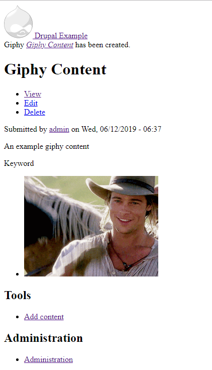

# Giphy
A module with giphy.com field formatter

This is a small module with a field formatter for plain text field. Like if you enter a keyword, it will fetch related giphy images from giphy.com and display it there. You can configure, how many giphy images you want to display there. This module is developed based on minimal drupal installation, so no styling is there.

# How to install
Just put the module in the drupal modules folder and enable it.

# Dependencies
This module has a contributed module dependency: <a href="https://www.drupal.org/project/focal_point">Focal Point</a>

# Giphy Text Formatter
This module enable a giphy content type with two additional fields - Giphy image and Keyword. If you create a content with a keyword, in the node view mode, you will see the giphy images there based on keyword.

This module enable a giphy text formatter for plain text field type. So for any content type, add a plain text field and in view display tab, change the field formatter to Giphy formatter.

---------------------------------------------------------------
For further assistance, you can contact me at: <strong>Shafiq Hossain</strong>, <em>md.shafiq.hossain@gmail.com</em>
